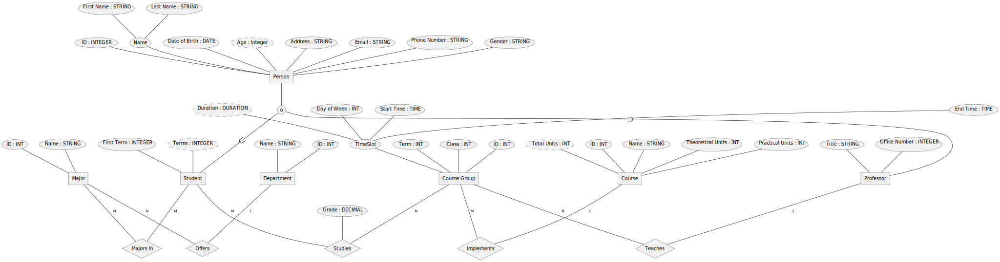

# پایگاه داده دانشگاه

[انگلیسی (English)](README.md)

این پروژه یک پایگاه داده پایه برای یک دانشگاه را پیاده سازی می‌کند.

پوشه ریشه حاوی ویدیویی است که از طریق [Motion Canvas](https://motioncanvas.io/)
ایجاد شده است، و پوشه [`university_database`](university_database/) حاوی
فایل‌های تکمیلی، از جمله تنظیمات Docker Compose و Jupyter Notebook است.

این ویدئو به دو زبان انگلیسی و فارسی موجود است. برای دیدن نسخه فارسی، متغیر
محیطی `VITE_LANG=fa` را قبل از اجرای `pnpm start` تنظیم کنید.

محتوای ویدئو به شرح زیر است:

## `title`

## `er-model`

### `relations-course-group`

- بیایید روابط گروه‌های درس را در نظر بگیریم.
- هر کدام یک درس را تعبیه می‌کنند،
- و توسط یک استاد تدریس می‌شود.
- در نهایت تعدادی از دانشجویان در آن شرکت می‌کنند.

### `relations-major`

- روابط دپارتمان‌ها را هم تعریف کنیم.
- آن‌ها بخشی از دانشگاه هستند و رشته‌های تحصیلی را ارائه می‌دهند،
- و سپس دانشجویان این رشته‌ها را دنبال می‌کنند.

### `attributes-person`

- درون طرح‌واره باید یک فرد را توصیف کنیم.
- یک فرد دارای یک شماره شناسایی منحصر به فرد است.
- ممکن است یک ایمیل،
- یک آدرس،
- شماره تلفن،
- تاریخ تولد،
- و یک نام داشته باشد.
- می‌توانیم نام را به دو قسمت تقسیم کنیم: نام کوچک و نام خانوادگی.

### `attributes-person-subclasses`

- طرح‌واره برای یک شخص توسط دو موجودیت استفاده می‌شود.
- یکی دانشجوها هستند. آن‌ها یک ویژگی اضافی برای ذخیره ترمی که در آن ثبت نام
  کرده‌اند دارند.
- دیگری اساتید هستند. آن‌ها دو ویژگی اضافی برای ذخیره مقام و شماره دفتر خود
  دارند. توجه داشته باشید که یک فرد می‌تواند هم دانشجو باشد و هم استاد.

### `attributes-course-group`

- اجازه دهید یک گروه کلاسی را تعریف کنیم.
- گروه کلاسی هم دارای یک شماره شناسایی منحصر به فرد است.
- فقط در یک ترم مشخص در دسترس است،
- در یک کلاس درس اتفاق می‌افتد،
- و دارای یک بازه زمانی است. از آنجایی که گروه‌های کلاسی هفتگی هستند، بازه زمانی
  روز هفته، زمان شروع و زمان پایان را مشخص می‌کند.

### `attributes-student-studies`

- همچنین باید نمره دانش آموزان را در گروه‌های درسی که مطالعه می‌کنند ذخیره کنیم.

## `part-install-mariadb`

### `docker-logo`

- ما از Docker Compose برای ساده کردن اجرای یک نمونه از MariaDB استفاده خواهیم
  کرد. باید هم Docker (Engine یا Desktop) و هم Docker Compose را نصب کنید.

### `docker-mirrors`

- اگر VPN راه اندازی نکرده‌اید، برای دسترسی به Docker Images باید چند رجیستری
  آینه تنظیم کنید.
- برای انجام این کار، فایل `daemon.json` را در پوشه پیکربندی ایجاد کنید. مکان
  پوشه به سیستم عامل شما بستگی دارد.

### `directory-structure`

- برای استفاده از Docker Compose ابتدا باید یک پوشه با نام پروژه خود ایجاد کنید.
- و در داخل آن، یک فایل `docker-compose.yaml` ایجاد کنید.

### `docker-compose-file`

- در این فایل سرویس پایگاه داده را تعریف می‌کنیم.
- این سرویس از docker image `mariadb` استفاده می‌کند،
- پورت `3306` را در معرض سیستم قرار می‌دهد،
- فایل‌های پایگاه داده را در یک volume ذخیره می‌کند،
- به داکر می‌گوید که هر زمان MariaDB متوقف شد، container را مجددا راه اندازی
  کند.
- و متغیر‌های خاصی از MariaDB را تنظیم می‌کند.

### `docker-compose-command`

- اکنون در ترمینال باید وارد پوشه پروژه شوید.
- سپس، برای شروع سرویس `docker compose up` را اجرا کنید. پرچم `-d` به سرویس
  اجازه می‌دهد در پس زمینه اجرا شود.

## `install-packages`

### `install-pdm`

- از مدیر وابستگی PDM برای نصب برخی بسته‌ها برای پایتون استفاده می‌کنیم. ابتدا
  باید خود PDM را نصب کنیم.

### `pdm-init`

- PDM به یک پروژه برای نصب بسته‌ها نیاز دارد. با این کار یک محیط مجازی به صورت
  خودکار ایجاد می‌شود.
- باید مفسر پایتون،
- نام پروژه،
- نسخه،
- آیا قرار است در PyPI منتشر شود،
- مجوز،
- نام نویسنده،
- ایمیل نویسنده،
- و در نهایت نسخه پایتون مورد نیاز  را انتخاب کنید.

### `pdm-add`

- به چهار بسته `pymysql`، `jupyterlab`، `ipython-sql` و `sqlalchemy` نیاز داریم.
  برای نصب آن‌ها می‌توانیم از دستور `pdm add` استفاده کنیم.

## `setup`

### `run-jupyter-server`

- اکنون که JupyterLab را نصب کردیم، باید سرور آن را راه اندازی کنیم.
- پس از اجرای دستور، JupyterLab باید در مرورگر باز شود، در غیر این صورت، فقط
  کافی است که روی لینک موجود در خروجی کلیک کنید.

### `load-ext-sql`

- برای تنظیم طرح‌واره پایگاه داده، باید چند دستور SQL را اجرا کنیم. ساده ترین
  راه استفاده از افزونه SQL IPython است. ابتدا افزونه را بارگذاری می‌کنیم،
- و سپس URL با فرمت SQLAlchemy به MariaDB اشاره می‌کنیم. این شامل نوع پایگاه
  داده (MySQL)، نام کتابخانه (PyMySQL)، نام کاربری (root)، رمز عبور (root)، نام
  میزبان (localhost)، شماره پورت (3306)، نام پایگاه داده (university)، و
  character set (`utf8mb4`) است.

### `create-db`

- برای وارد کردن عبارات SQL در Jupyter Notebook پیشوند عبارت `%%sql` قرار
  می‌گیرد. ابتدا پایگاه داده دانشگاه را بازسازی خواهیم کرد،
- و سپس آن را به عنوان پایگاه داده فعال انتخاب کنید.

### `create-table`

- قرار است جداول را طبق مدل ER ایجاد کنیم. شناسه هر جدول یک کلید
  `PRIMARY AUTO_INCREMENT` خواهد بود. جدول `Student` همانطور است که در مدل ER
  تعریف شده.
- جدول `Professor` نیز همانطور است که در مدل ER تعریف شده.
- جدول `Department` دارای شناسه و نام خواهد بود.
- جدول `Major` دارای ستون `department_id` که به یک ردیف در جدول `Department`
  اشاره می‌کند.
- جدول `Course` دارای شناسه، نام و واحدهای درس خواهد بود که به واحدهای نظری و عملی
  تقسیم می‌شوند.
- جدول `CourseGroup` دارای دو ستون `professor_id` و `course_id` است که به ترتیب
  به جداول `Professor` و `Course` اشاره می‌کنند.
- جدول `Study` دارای دو ستون `Student_id` و `course_group_id` خواهد بود که به
  ترتیب به جداول `Student` و `CourseGroup` اشاره می‌کنند.
- در نهایت، جدول `Enrollment` دارای دو ستون `student_id` و `major_id` خواهد بود
  که به ترتیب به جداول `Student` و `Major` اشاره می‌کنند.

## `usage`

### `def-connect`

- برای اتصال به پایگاه داده باید از تابع PyMySQL `connect` استفاده کنیم.
- باید همان گزینه‌های احراز هویت قسمت قبل را وارد کنیم. ما همچنین `autocommit`
  را فعال خواهیم کرد، در غیر این صورت باید به صورت دستی commit را انجام دهیم.

### `def-insert`

- در حالی که می‌توانیم مستقیماً از SQL استفاده کنیم، ممکن است تعریف کمکی در
  انجام برخی از عملیات‌ها مفید باشد. از آنجایی که می‌خواهیم ورودی‌ها را در
  پایگاه داده وارد کنیم، می‌خواهیم تابعی را تعریف کنیم تا این کار را برای ما
  انجام دهد. نام جدول و جفت‌های کلید-مقدار را به عنوان آرگومان‌های کلید واژه‌ای
  می‌پذیرد و شناسه ردیف درج شده را برمی گرداند.
- ابتدا به سرور متصل می‌شویم.
- سپس ما یک cursor ایجاد می‌کنیم.
- ما کلیدها را به یک رشته join می‌کنیم تا در داخل عبارت `INSERT INTO` قرار گیرد.
- همچنین متغیرهایی را برای مقادیر ایجاد خواهیم کرد. توجه داشته باشید که در
  PyMySQL، کوئری‌های پارامتری شده به جای `?` از `%s` استفاده می‌کنند.
- ما متد `execute` را فراخوانی می‌کنیم.
- اولین آرگومان عبارتی است که باید اجرا شود. ما عبارت `INSERT INTO` را اجرا
  خواهیم کرد.
- ارگومان دوم، ارگومان‌های دستور SQL است.
- در نهایت، از ویژگی `lastrowid` cursor برای شناسایی سطر درج شده استفاده
  می‌کنیم.

### `insert`

- ما قصد داریم مقداری داده را در پایگاه داده خود وارد کنیم. برای ساده نگه داشتن
  این ویدئو، فقط یک ورودی را در هر جدول درج می‌کنیم. ابتدا اجازه دهید با تعریف
  دپارتمان کامپیوتر شروع کنیم.
- این گروه رشته مهندسی کامپیوتر را ارائه می‌دهد.
- درس ساختمان داده را تعریف می‌کنیم که ۳ واحد تئوری است.
- پروفسور فرضی جیک تیلور،
- دانشجوی فرضی احمد آدامز،
- که در رشته مهندسی کامپیوتر ثبت نام کرده است،
- گروه درسی برای ساختمان داده، که توسط جیک تیلور هر دوشنبه تدریس می‌شود،
- که احمد آدامز آن را انتخاب کرده و نمره ۱۸٫۲۵ را کسب کرده است.

### `student-grades`

- به غیر از درج، ما همچنین می‌توانیم داده‌ها را برای اهداف خاصی بازیابی کنیم.
  یکی از این اهداف دریافت لیست نمرات یک دانش آموز است. با توجه به شناسه
  دانشجویی،
- ابتدا به سرور متصل می‌شویم،
- cursor را ایجاد می‌کنیم،
- و سپس یک پرسمان SQL را اجرا می‌کنیم.
- از جدول `Study` استفاده می‌کنیم،
- و فقط ردیف‌هایی را با شناسه دانشجویی صحیح انتخاب می‌کنیم.
- ما همچنین می‌خواهیم اطلاعاتی در مورد درس بازیابی کنیم، بنابراین با جدول
  `CourseGroup` join می‌کنیم.
- و سپس با جدول `Course` join می‌کنیم.
- از این جداول نمره، ترم، نام درس و تعداد واحد کل درس را بازیابی می‌کنیم.
- در نهایت، ما همه ردیف‌ها را واکشی خواهیم کرد.

### `course-group-grades`

- برخی از اهداف دیگر شامل وارونگی مورد قبلی است: دریافت لیست نمرات یک گروه درسی.
  با توجه به یک گروه درسی،
- ابتدا به سرور متصل می‌شویم،
- cursor را ایجاد می‌کنیم،
- و سپس یک پرسمان SQL را اجرا می‌کنیم.
- از جدول `Study` استفاده می‌کنیم،
- و ما فقط ردیف‌هایی را با شناسه گروه درسی درست انتخاب می‌کنیم.
- ما همچنین می‌خواهیم اطلاعاتی در مورد دانش آموزان بازیابی کنیم، بنابراین با
  جدول `Student` join می‌کنیم.
- از این جداول نمره، نام و نام خانوادگی دانش آموز را بازیابی می‌کنیم.
- در نهایت، ما همه ردیف‌ها را واکشی خواهیم کرد.

## `end`
