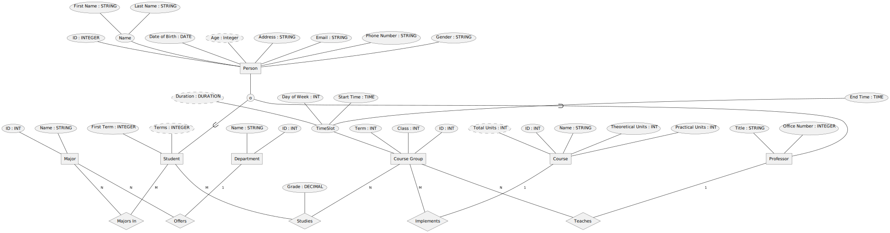

# University Database

[Persian (فارسی)](README.fa-IR.md)

This project implements a basic university database.

The root directory contains a video created via [Motion
Canvas](https://motioncanvas.io/), and the
[`university_database`](university_database/) directory contains some
supplementary files, including Docker Compose configurations and Jupyter
Notebooks.

The video is available in both English and Persian. To see the Persian version,
set `VITE_LANG=fa` environment variable before running `pnpm start`.

Note that the instructions are a bit opinionated. It is easier to explain one
method fully than many methods incompletely.

The following sections are part of the video script.

## `title`

## `er-model`

### `relations-course-group`

- Let us consider the relations of course groups.
- Each one implements one course,
- and is taught by a professor.
- Finally, it is studied by a number of students.

### `relations-major`

- Let us also define the relations of departments.
- They are a division of university which offer majors,
- and the students then pursue these majors.

### `attributes-person`

- Within the schema we need to describe a person.
- A person has a unique ID number.
- They may have an email,
- an address,
- a phone number,
- a date of birth,
- and a name.
- We can (optionally) split the name into two parts: First name and last name.
  (Omitted in this slide is the one character gender marker. I found out too
  late, and the diagram looked better without it. Meh, whatever.)

### `attributes-person-subclasses`

- The schema for a person is used by two entities.
- One is the students. They have an extra attribute to store which term they
  first signed up.
- The other is the professors. They have two extra attributes to store their
  title and their office number. Note that a person can be both a student and a
  professor. (Since this database is rather basic, I have omitted other kinds of
  people—e.g., administrators. It also does not store financial details for
  faculty members and students. I would have fitted them in the margins, but
  there are no margins in the first place.)

### `attributes-course-group`

- Let us describe a course group.
- It, too, has a unique ID number.
- It is available only in a certain term,
- takes place in a classroom,
- and has a time slot. Since course groups are weekly, time slot specifies week
  day, start time, and end time.

### `attributes-student-studies`

- We also have to store the grade of students in the course groups they study.

## `part-install-mariadb`

### `docker-logo`

- We will use Docker Compose to simplify running an instance of MariaDB. You
  will need to have both Docker (Engine or Desktop) and Docker Compose
  installed.

### `docker-mirrors`

- If you live in Iran and have not set a VPN up yet, you will have to set some
  mirror registries up to access Docker Images.
- To do that, create the `daemon.json` file in the configuration directory. The
  directory is dependent on your Operating System.

### `directory-structure`

- To use Docker Compose you will first need to create a directory with the name
  of your project.
- Inside, create a `docker-compose.yaml` file.

### `docker-compose-file`

- In this file we will define the database service. (You may need a
  `version: "3"` property depending on your version of Docker Compose.)
- This service uses the `mariadb` Docker image,
- exposes the port `3306` to the system,
- saves the database files inside a volume,
- tells Docker to restart the container whenever MariaDB stops,
- and sets certain MariaDB configurations up. (Note that specifying the
  passwords directly is not safe, despite the slide doing just that. You should
  use the `MARIADB_ROOT_PASSWORD_FILE` variable with an appropriately-`chmod`ed
  file containing the password.)

### `docker-compose-command`

- Now, in the terminal, you will need to enter the project directory.
- Then, to start the database simple run `docker compose up`. The `-d` flag lets
  the service run in the background.

## `install-packages`

### `install-pdm`

- We will use the PDM dependency manager to install some packages for use with
  python. First, we need to install PDM itself. (You can also use PIP or
  Poetry.)

### `pdm-init`

- PDM needs a project to install packages into. This will create a virtual
  environment automatically. (Note that PDM also works with the rejected PEP
  582—i.e., `__pypackages__`\.)
- You need to select the version of python,
- project name,
- version,
- whether it is going to be published to PyPI,
- license (This needs to follow the SPDX notation),
- author name,
- author email,
- and finally the required python version.

### `pdm-add`

- We will need four packages, `pymysql`, `jupyterlab`, `ipython-sql`, and
  `sqlalchemy`. We can use the `pdm add` command to install them. (In a
  different machine, you can run `pdm install` to reinstall the packages from
  the `pyproject.toml` file.)

## `setup`

### `run-jupyter-server`

- Now that we have installed JupyterLab, we need to start its server.
- After running the command, JupyterLab should open in the browser, If not, you
  can just click on the link in the output. (You can also use this link inside
  external programs, like VS Code.)

### `load-ext-sql`

- To set the database schema up, we need to run a few SQL statements. The
  simplest way is to use the SQL IPython extension to do that. First we will
  load the extension,
- and then we pass the SQLAlchemy URL format to MariaDB. This includes the
  database type (MySQL), library name (PyMySQL), username (root), password
  (root), host name (localhost), port number (3306), database name (university),
  and the character set (`utf8mb4`).

### `create-db`

- To enter SQL statements in Jupyter Notebook will prefix the statement with
  `%%sql`. We will first recreate the university database,
- and then select it as the active database. (For some reason, just specifying
  it in the connection URL is not enough.)

### `create-table`

- We are going to create the tables according to the ER model. The ID of every
  table will be an auto incremented primary key. The `Student` table is as
  defined in the ER model.
- The `Professor` table is also as defined in the ER model.
- The `Department` table will have an ID and a name.
- The `Major` table will have the column `department_id` reference a row in the
  `Department` table.
- The `Course` table will have an ID, a name, and the units of the course, split
  into theoretical units and practical units.
- The `CourseGroup` table will have two columns `professor_id` and `course_id`
  which reference `Professor` and `Course` tables respectively.
- The `Study` table will have two columns `student_id` and `course_group_id`
  which reference `Student` and `CourseGroup` tables respectively.
- Finally, the `Enrollment` table will have two columns `student_id` and
  `major_id` which reference `Student` and `Major` tables respectively.

## `usage`

### `def-connect`

- To connect to the database, we need to use the PyMySQL `connect` function.
- We need to pass the same authentication options as the previous section. We
  will also enable `autocommit`, otherwise we would have to commit manually.

### `def-insert`

- While we can directly use SQL, it may be helpful to define a helper around
  some operations. Since we want to insert entries into the database, we are
  going to define a function to do that for us. It will accept the table name
  and the key-value pairs as the keyword arguments and return the ID of the
  inserted row.
- First we will connect to the server.
- Then we will create a cursor.
- We will concatenate the keys into a string to be placed inside the
  `INSERT INTO` statement.
- We will also create the placeholders for values. Note that in PyMySQL,
  parameterized queries uses `%s` instead of `?`.
- We will call the `execute` method.
- The first argument is the statement to execute. We will run an `INSERT INTO`
  statement.
- The second argument is the arguments to the statement.
- Finally, we will use the `lastrowid` attribute of the cursor to identify the
  inserted row.

### `insert`

- We are going to insert some data into our database. To keep things simple, we
  are going to only insert one entry into each table. First, lets start with
  defining the Computer department.
- This department provides the Computer Engineering major.
- We define the Data Structures course, which is worth 3 theoretical units,
- the fictional professor Jake Taylor,
- the fictional student Ahmed Adams,
- which enrolls in the Computer Engineering major,
- the course group for Data Structures, taught by Jake Taylor every Monday
  (assuming Saturday is 0),
- which Ahmed Adams studies and has earned a grade of 18.25 (out of 20).

### `student-grades`

- Other than inserting, we can also retrieve the data for certain purposes. One
  such purpose is to get the list of grades of a student. Given the student ID,
- We will first connect to the server,
- Create a cursor,
- and then execute an SQL query.
- The query will be read from the `Study` table,
- and we will only pick the rows with the correct student ID.
- We also want to retrieve some information about the course, so we will join
  with the `CourseGroup` table,
- and join that with the `Course` table.
- From these tables, we will retrieve the grade, the term, the name of the
  course, and the total unit count of the course.
- Lastly, we will fetch all the entries.

### `course-group-grades`

- Some other purpose includes the inversion of the previous one: get the list of
  grades of a course group. Given a course group,
- We will first connect to the server,
- Create a cursor,
- and then execute an SQL query.
- The query will be read from the `Study` table,
- and we will only pick the rows with the correct course group ID.
- We also want to retrieve some information about the students, so we will join
  with the `Student` table,
- From these tables, we will retrieve the grade, the first name, and the last
  name of the student.
- Lastly, we will fetch all the entries.

## `end`
